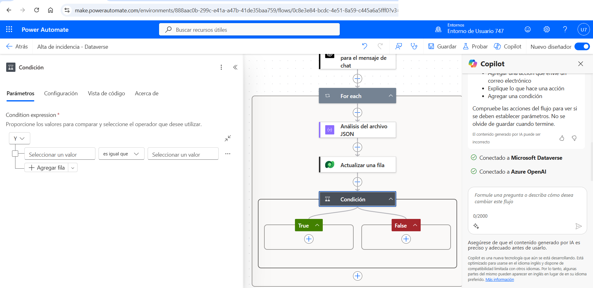
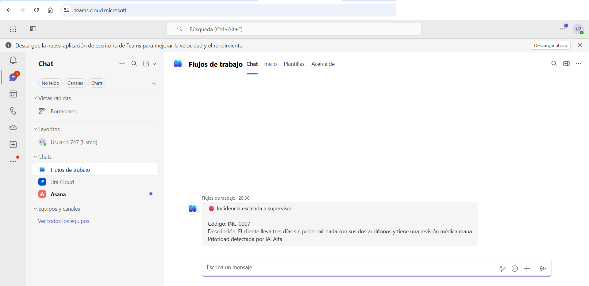
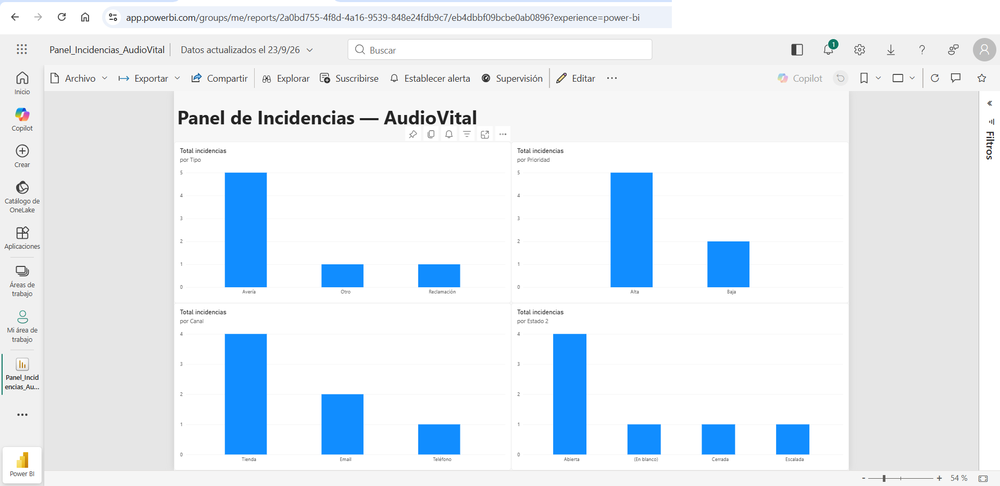

# Automatización de gestión de incidencias con Power Platform e IA generativa

Circuito completo de gestión de incidencias de atención al cliente construido sobre **Microsoft Power Platform**, con clasificación automática mediante un modelo de lenguaje desplegado en **Azure OpenAI**.

Caso ficticio (**AudioVital**), datos 100 % inventados. Proyecto de portafolio construido, ejecutado y verificado en un entorno real.

---

## Qué hace

Un agente registra una incidencia describiéndola con sus propias palabras. A partir de ahí, sin intervención humana:

1. **Dataverse** asigna el código `INC-0000` automáticamente.
2. **Azure OpenAI** (`gpt-4.1-mini`) lee la descripción y determina **tipo** y **prioridad**.
3. **Power Automate** traduce esa respuesta y actualiza el registro.
4. Si la prioridad es **Alta**, marca la incidencia como escalada y **avisa al supervisor por Microsoft Teams**.
5. Cualquiera puede **preguntar en lenguaje natural** desde Teams y recibir la respuesta leída en vivo de Dataverse.
6. Un panel de **Power BI** conectado a Dataverse ofrece la visión agregada.

Tiempo de proceso por incidencia: **2–3 segundos**.



*Flujo 1: el bucle procesa la respuesta del modelo, actualiza la incidencia y evalúa si procede escalarla.*

---

## Arquitectura

| Capa | Tecnología | Función |
|---|---|---|
| Datos | Microsoft Dataverse | Fuente única de verdad; autonumeración de códigos |
| Captura | Power Apps | Formulario de alta y consulta |
| Orquestación | Power Automate | Dispara, clasifica, actualiza y escala |
| Inteligencia | Azure OpenAI · `gpt-4.1-mini` | Clasificación y redacción de respuestas |
| Interacción | Microsoft Teams | Avisos de escalado y consultas conversacionales |
| Analítica | Power BI | Panel interactivo con medida DAX |

---

## Componentes construidos

- **3 tablas de Dataverse** relacionadas: `Clientes`, `Productos_Servicios`, `Incidencias`
- **1 aplicación de Power Apps** para el alta de incidencias
- **Flujo 1 — `Alta de incidencia`**: clasificación por IA, actualización del registro y escalado condicional a Teams
- **Flujo 2 — `Consulta de incidencias`**: asistente conversacional sobre Teams que consulta Dataverse y responde con IA
- **Panel de Power BI** con 4 visualizaciones y medida DAX, conectado en vivo a Dataverse



*Aviso automático al supervisor cuando la IA clasifica la incidencia como prioridad Alta.*

---

## Decisiones técnicas destacadas

| Restricción del entorno | Solución aplicada |
|---|---|
| SharePoint no disponible en el inquilino | Persistencia rediseñada sobre tablas nativas de Dataverse |
| Microsoft Forms no habilitado | Aplicación de Power Apps + desencadenador de creación de fila |
| Copilot Studio sin créditos | Asistente reconstruido con Power Automate + Teams + Azure OpenAI |
| Modelo de IA sin cuota en la región | Despliegue de una alternativa vigente de la misma familia |

> **Nota sobre Copilot Studio:** el agente llegó a crearse y se le conectó correctamente el **servidor MCP de Microsoft Dataverse** como herramienta. La ejecución quedó bloqueada únicamente por falta de créditos de Copilot en el inquilino — un límite de licencia, no de configuración.

---

## Detalles de implementación

**Clasificación (mensaje de sistema enviado al modelo):**

```
Eres un asistente que clasifica incidencias de atención al cliente.
Analiza la descripción y responde ÚNICAMENTE con un JSON con este
formato exacto: {"tipo": "Reclamación" o "Avería" o "Otro",
"prioridad": "Alta" o "Media" o "Baja"}.
No incluyas texto adicional, solo el JSON.
```

**Traducción a valores internos de Dataverse** (las columnas de opción almacenan enteros, no texto):

```
if(contains(toLower(json(items('For_each')?['message']?['content'])?['prioridad']),'alta'),
   610150000,
   if(contains(toLower(json(items('For_each')?['message']?['content'])?['prioridad']),'media'),
      610150001, 610150002))
```

**Medida DAX del panel:**

```dax
Total incidencias = COUNTROWS(cr3f3_incidencias)
```

---

## Panel analítico



*Panel publicado en el servicio de Power BI, conectado en vivo a Dataverse. Los cuatro gráficos comparten modelo, de modo que al seleccionar una categoría el resto se filtra en consecuencia.*

---

## Verificación

| Descripción de la incidencia | Esperado | Resultado |
|---|---|---|
| Cobro duplicado, exige devolución | Reclamación / Alta | Correcto |
| Pitido intermitente sin pérdida de función | Avería / Baja | Correcto |
| Petición de cambio de cita | Otro / Baja | Correcto |
| Pérdida total de audición, cita médica inminente | Avería / Alta + escalado | Correcto |

El resto de evidencias (tablas de Dataverse, formulario, historial de ejecuciones, asistente conversacional y agente de Copilot Studio) están en [`capturas/`](capturas/).

---

## Documentación

La memoria técnica completa (16 páginas) está en [`docs/`](docs/): arquitectura, esquema de datos, secuencia de ambos flujos, prompts y expresiones íntegros, restricciones del entorno, problemas resueltos y verificación.

---

## Estado y continuación

Este es el **primer caso de uso** de tres previstos sobre la misma arquitectura, para demostrar que el patrón es reutilizable:

- [x] **Caso 1 — Gestión de incidencias** (completado)
- [ ] Caso 2 — Solicitudes de compra, con aprobación por importe
- [ ] Caso 3 — Gestión de clientes potenciales, con cualificación automática

---

## Autor

**José Rafael Vázquez Silva** — Especialista en automatización con IA
[GitHub](https://github.com/RafaVazquezSilva)

*Todos los datos, nombres de clientes y marcas empleados en este proyecto son ficticios y fueron creados exclusivamente con fines de demostración.*
